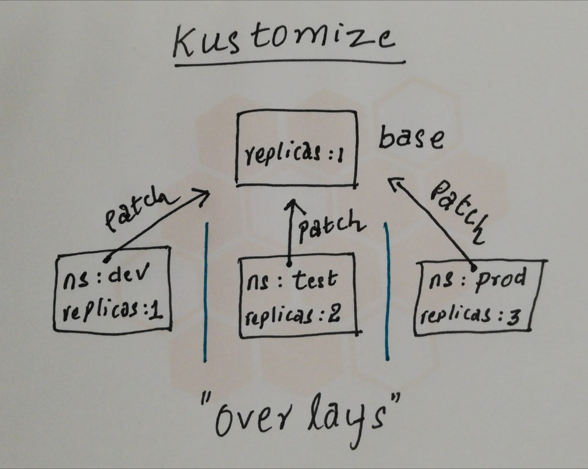

## Getting Started With Kustomize
[](k8s-titleimage.png)

### Declarative management of Kubernetes resources with a hands-on example
Kubernetes is one of the well-known container orchestrators and has led to the development of an entire ecosystem around it. It has allowed organizations to manage their container applications with ease by providing several resources to manage container deployments, replicas, scaling, service discovery, and networking through a single API Interface.
Most organizations have multiple environments to develop and test these applications before deploying them into production. Configuration between these environments might differ, and there might be several aspects that you may want to tweak.
There are various ways to manage your Kubernetes resources for multiple environments, such as Helm and Kustomize. Helm is the most dynamic template-based Kubernetes resource manager. However, you may not need Helm for everything. Kustomize is a Kubernetes native method of managing your Kubernetes resource manifests for multiple environments. It works on the overlay principle to do that. Let’s understand both approaches in the next section.

### Template vs. Overlay
A template-based engine works on the principle of substituting variables with values. Helm, a template-based engine, allows you to define a generic template-based manifest by declaring variable placeholders at specific places of the generic manifest. You then use a variable file to substitute the variable with values.

An overlay-based engine works on the principle of find and replace, i.e., it searches for specific sections in the manifest and replaces them with the required values using a find, replace, and merge-based strategy. That allows you to create base manifest files, which are pretty much standard Kubernetes resource definition files and can be deployed on their own. You can then use Kustomize to further customize those files according to your requirements.

### Why Kustomize
When we do deployments across multiple environments there are cases where some things need to be changed based on the environment. kustomize helps us with that in a template-free manner. There are no ugly if-else in our templates (conditionals in templates are bad) which also makes the output of these templates as K8s native. kustomize takes the approach where we basically combine the base and apply patch to create a variant.

For eg, we created ``` base ``` a starting point for any further configurations. Then based on the environment (dev/test/prod) we create overalys. In these overalys, we again specify the things to be changed referencing a base called patches. The changes are applied on top of the base and the resultant output is called a variant. So if we create 3 overlays referencing the same base we get 3 variants to deploy based on the environment. This approach helps us to keep the base as clean as possible and only fiddle with the values that change across environments.

*Base Layer*: This layer specifies the most common resources and original configuration

*Overlays Layer*: This layer specifies use-case-specific resources by utilizing patches to override other kustomization files and Kubernetes manifests.

### Kustomize offers some of the following benefits:

#### Reusability
With Kustomize you can reuse one of the base files across all environments (development, staging, production, etc.) and overlay specifications for each of those environments.

#### Quick Generation
Since Kustomize doesn’t utilize templates, a standard YAML file can be used to declare configurations.

#### Debug Easily
Using a YAML file allows easy debugging, along with patches that isolate configurations, allowing you to pinpoint the root cause of performance issues quickly. You can also compare performance to the base configuration and other variations that are running.

#### Kubernetes Native Configuration
Kustomize understands Kubernetes resources and their fields and is not just a simple text templating solution like other tools.

### How Kustomize Works
Kustomize uses a file called ``` kustomization.yaml ``` that contains declarative specifications to what resources need to be imported from what manifest files and what changes need to be made. Once it has processed the resources, it emits them to the standard output, which can be stored in a file or directly used with kubectl to apply it to a particular cluster.
One of the excellent use cases of Kustomize is to manage Kubernetes resources for multiple environments. For Kustomize to work in that scenario, you would need a base directory that would contain all manifest files with all the common elements and an overlays directory that contains all the differences for a particular environment.
To understand better, let’s look at a hands-on example where we want to run 1 pod in dev env, 2 in test & 3 in prod env's 

### Prerequisites
You will need a Kubernetes cluster running Kubernetes version 1.14 or later and the kubectl CLI of a similar version.

You would also need to fork https://github.com/pratsgl/kubernetes-kustomize repository.

We would also need to install Kustomize. So, let’s look at that in the next section.

### Installing Kustomize
There are various ways to install Kustomize, which you can find in https://kubectl.docs.kubernetes.io/installation/kustomize/. In our case, we’ll use the binary method of installing it.
To do so, run the following commands:

```ssh
$ curl -s "https://raw.githubusercontent.com/kubernetes-sigs/kustomize/master/hack/install_kustomize.sh"  | bash
$ sudo mv kustomize /usr/bin/
```

As we’ve installed Kustomize, let’s understand the problem statement and what we’re planning to implement.

### Problem Statement

[](kustomize-image-new.jpg)

We have a web application that we want to deploy in several environments. It has the following environment-specific differences:
1. It should contain an env label corresponding to the environment it is being deployed on (i.e., dev, test, and prod).
2. It should be deployed on namespaces corresponding to the environment (i.e., dev, test, and prod).
3. The number of replicas in the dev environment should be one, two in test, and three in prod.
4. In the prod environment, we will implement a rolling update strategy with maxSurge 1 and maxUnavailable 1.

So, let’s go ahead and look at the directory structure for that.

### Directory Structure
We will create a ``` Deployment ``` and a ``` Service ``` resource in two files — ``` deployment.yaml ```, and ``` service.yaml``` . The directory structure looks like the following:

``` 
kustomize-example-app/
├── base
│   ├── deployment.yaml
│   ├── kustomization.yaml
│   └── service.yaml
└── overlays
    ├── dev
    │   ├── deployment.yaml
    │   ├── kustomization.yaml
    │   ├── namespace.yaml
    │   └── service.yaml
    ├── prod
    │   ├── deployment.yaml
    │   ├── kustomization.yaml
    │   ├── namespace.yaml
    │   └── service.yaml
    └── test
        ├── deployment.yaml
        ├── kustomization.yaml
        ├── namespace.yaml
        └── service.yaml
   ```
   
The ``` base ``` directory contains the base manifests and a ``` kustomization.yaml ``` file that contains all the common elements between the three environments. The ``` overlays ``` directory includes a directory each for ``` dev, test ```, and ``` prod ```. As we are simply changing the properties of both ``` Deployment ``` and ``` Service ``` resources in the dev, test, and prod environments, we have a manifest each for them. However, the manifests would only contain the differences between the resources.
Let’s look at the ``` base ``` directory first.

### The Base Configuration

In the ``` base ``` directory, the ``` deployment.yaml ``` file looks like the following:

```
apiVersion: apps/v1
kind: Deployment
metadata:
  name: nginx-deployment
  labels:
    app: nginx
spec:
  replicas: 1
  selector:
    matchLabels:
      app: nginx
  template:
    metadata:
      labels:
        app: nginx
    spec:
      containers:
      - name: nginx
        image: nginx
        ports:
        - containerPort: 80
```

The ``` service.yaml ``` file looks like the below:

```
apiVersion: v1
kind: Service
metadata:
  name: nginx-service
  labels:
    app: nginx
spec:
  ports:
  - port: 80
    protocol: TCP
    targetPort: 80
    name: http
  type: LoadBalancer
  selector:
    app: nginx
```

Now, for Kustomize to work, we need to create a ``` kustomization.yaml ``` file that will look like the following:

```
apiVersion: kustomize.config.k8s.io/v1beta1
kind: Kustomization
resources:
  - deployment.yaml
  - service.yaml
```

As we can see, the Kustomization file contains the ``` apiVersion ``` and kind attributes like any other Kubernetes resource. The file can also have several sections based on what you’re planning to do. In this case, as we’re just trying to import the ``` Deployment ``` and  ``` Service ``` in the Kustomization, we use the ``` resources ``` section to do so.
When we run the ``` kustomize build ``` command on the ``` base ``` directory, Kustomize emits a manifest yaml that is a combination of the two.

```
$ kustomize build base
apiVersion: v1
kind: Service
metadata:
  labels:
    app: nginx
  name: nginx-service
spec:
  ports:
  - name: http
    port: 80
    protocol: TCP
    targetPort: 80
  selector:
    app: nginx
  type: LoadBalancer
---
apiVersion: apps/v1
kind: Deployment
metadata:
  labels:
    app: nginx
  name: nginx-deployment
spec:
  replicas: 1
  selector:
    matchLabels:
      app: nginx
  template:
    metadata:
      labels:
        app: nginx
    spec:
      containers:
      - image: nginx
        name: nginx
        ports:
        - containerPort: 80
```

Now, let’s go ahead and let’s look at the environment-specific configs.

### The Environment-Specific Configurations
Now, we will focus on the ``` overlays ``` directory. We have directories within the overlays directory for the ``` dev, test ```, and ``` prod ``` environments. Let’s look at the contents of the ``` dev ``` directory first.

#### The dev configuration

The ``` namespace.yaml ``` file looks like the following:

```
apiVersion: v1
kind: Namespace
metadata:
  name: dev
```
Now, this wasn’t there in the base configuration as the namespace will change with the environment.
Let’s look at the ``` kustomization.yaml ``` file now:

```
apiVersion: kustomize.config.k8s.io/v1beta1
kind: Kustomization

bases:
- ../../base

commonLabels:
  env: dev

resources:
  - namespace.yaml

namespace: dev
```

Here, you can see that there are several sections. Let’s look at each of them in detail:
* ``` bases ```  — This section contains the reference to the base directory.
* ``` commonLables ``` — This section defines any common labels that we want to apply to all resources generated by Kustomize. As per our requirement, we’ve given the label env:dev.
* ``` resources ``` — This section contains any additional resources we want to add to the Kustomize configuration. As we have the namespace.yaml file as an additional manifest file that we’ve specified here.
* ``` namespace ``` — This section defines any common namespace where the resources should be deployed. In this case, it is dev.

Now, let’s run ``` kustomize build ``` on the dev directory and see what we get:

```
$ kustomize build overlays/dev
apiVersion: v1
kind: Namespace
metadata:
  labels:
    env: dev
  name: dev
---
apiVersion: v1
kind: Service
metadata:
  labels:
    app: nginx
    env: dev
  name: nginx-service
  namespace: dev
spec:
  ports:
  - name: http
    port: 80
    protocol: TCP
    targetPort: 80
  selector:
    app: nginx
    env: dev
  type: LoadBalancer
---
apiVersion: apps/v1
kind: Deployment
metadata:
  labels:
    app: nginx
    env: dev
  name: nginx-deployment
  namespace: dev
spec:
  replicas: 1
  selector:
    matchLabels:
      app: nginx
      env: dev
  template:
    metadata:
      labels:
        app: nginx
        env: dev
    spec:
      containers:
      - image: nginx
        name: nginx
        ports:
        - containerPort: 80
```

And, as we can see, it meets all our requirements.
To apply the manifest to the Kubernetes cluster, we can use the following kubectl command:
```
$ kubectl apply -k overlays/dev
namespace/dev created
service/nginx-service created
deployment.apps/nginx-deployment created
```

As we see, all three resources have been created. Let’s list all resources within the dev namespace using the following:

```
$ kubectl get all -n dev --show-labels
NAME                                    READY   STATUS    RESTARTS   AGE   LABELS
pod/nginx-deployment-75f4c7859f-7cskf   1/1     Running   0          46m   app=nginx,env=dev,pod-template-hash=75f4c7859f

NAME                    TYPE           CLUSTER-IP      EXTERNAL-IP                                                               PORT(S)        AGE   LABELS
service/nginx-service   LoadBalancer   172.20.200.14   a55e7736c03df43f792ea0668d4599f1-2025186212.us-west-2.elb.amazonaws.com   80:30333/TCP   46m   app=nginx,env=dev

NAME                               READY   UP-TO-DATE   AVAILABLE   AGE   LABELS
deployment.apps/nginx-deployment   1/1     1            1           46m   app=nginx,env=dev

NAME                                          DESIRED   CURRENT   READY   AGE   LABELS
replicaset.apps/nginx-deployment-75f4c7859f   1         1         1       46m   app=nginx,env=dev,pod-template-hash=75f4c7859f
```

Great! Now, we have a ``` Deployment ``` with one replica ``` Pod ``` exposed by a Load Balancer ``` Service ```. All these resources are deployed to the dev namespace, and contain the label ``` env: dev ```.
Now, let’s move on to the test directory to see what we have there.

#### The test configuration
Within the ``` test ``` directory, we have the following ``` namespace.yaml ``` file:

```
apiVersion: v1
kind: Namespace
metadata:
  name: test
```

Along with that, we have the following ``` deployment.yaml ``` file:

```
apiVersion: apps/v1
kind: Deployment
metadata:
  name: nginx-deployment # necessary for Kustomize identification
spec:
  replicas: 2
```

The reason for having a ``` deployment.yaml ``` file here was because we wanted to change the number of replicas in the test environment from 1 to 2.
Now, let’s look at the ``` kustomization.yaml ``` file :

```
apiVersion: kustomize.config.k8s.io/v1beta1
kind: Kustomization

bases:
- ../../base

commonLabels:
  env: test

resources:
  - namespace.yaml

namespace: test

patchesStrategicMerge:
  - deployment.yaml
```

Most of the sections are similar to the dev ``` kustomization.yaml ``` file. However, we have an additional section here, i.e.,``` patchesStrategicMerge ```. Within that, we’ve declared the ``` deployment.yaml ``` file that contains just the delta configuration (patch), i.e., the number of replicas. The ``` patchesStrategicMerge ``` will patch all resources that match the resource ``` name, kind, ``` and ``` apiVersion ``` with the configurations declared in the patch yaml files.

When we run a kustomize build on the ``` test ``` directory, we will get the following:
```
$ kustomize build overlays/test
apiVersion: v1
kind: Namespace
metadata:
  labels:
    env: test
  name: test
---
apiVersion: v1
kind: Service
metadata:
  labels:
    app: nginx
    env: test
  name: nginx-service
  namespace: test
spec:
  ports:
  - name: http
    port: 80
    protocol: TCP
    targetPort: 80
  selector:
    app: nginx
    env: test
  type: LoadBalancer
---
apiVersion: apps/v1
kind: Deployment
metadata:
  labels:
    app: nginx
    env: test
  name: nginx-deployment
  namespace: test
spec:
  replicas: 2
  selector:
    matchLabels:
      app: nginx
      env: test
  template:
    metadata:
      labels:
        app: nginx
        env: test
    spec:
      containers:
      - image: nginx
        name: nginx
        ports:
        - containerPort: 80
```
Now, let’s apply this to our Kubernetes cluster using the following command:
```
$ kubectl apply -k overlays/test
namespace/test created
service/nginx-service created
deployment.apps/nginx-deployment created
```

Similarly, let’s get the details of all resources deployed in the ``` test ``` namespace using the command below:
```
$ kubectl get all -n test --show-labels
NAME                                    READY   STATUS    RESTARTS   AGE   LABELS
pod/nginx-deployment-5d5fbdc544-5nj84   1/1     Running   0          34m   app=nginx,env=test,pod-template-hash=5d5fbdc544
pod/nginx-deployment-5d5fbdc544-c8z2k   1/1     Running   0          34m   app=nginx,env=test,pod-template-hash=5d5fbdc544

NAME                    TYPE           CLUSTER-IP      EXTERNAL-IP                                                              PORT(S)        AGE   LABELS
service/nginx-service   LoadBalancer   172.20.131.13   adddc6dd4de8f4b4c9871431ad7edae5-112128047.us-west-2.elb.amazonaws.com   80:30934/TCP   34m   app=nginx,env=test

NAME                               READY   UP-TO-DATE   AVAILABLE   AGE   LABELS
deployment.apps/nginx-deployment   2/2     2            2           34m   app=nginx,env=test

NAME                                          DESIRED   CURRENT   READY   AGE   LABELS
replicaset.apps/nginx-deployment-5d5fbdc544   2         2         2       34m   app=nginx,env=test,pod-template-hash=5d5fbdc544

```
And as we see, we have a Deployment running two replicas this time.
Let’s now move on to the ``` prod ``` example.

#### The prod configuration

The ``` prod ``` directory consists of the ``` namespace.yaml ``` similar to the test and dev configuration:

```
apiVersion: v1
kind: Namespace
metadata:
  name: prod
```

It also contains the following ``` deployment.yaml ``` patch manifest:

```
apiVersion: apps/v1
kind: Deployment
metadata:
  name: nginx-deployment # necessary for Kustomize identification
spec:
  replicas: 3
  strategy:
    rollingUpdate:
      maxSurge: 1
      maxUnavailable: 1
    type: RollingUpdate
```

This patch contains three ``` Deployment ``` replicas, and also a deployment strategy section with type ``` RollingUpdate, maxSurge 1 ```, and ``` maxUnavailable 1 ```.
Let’s now look at the ``` kustomization.yaml ``` file:

```
apiVersion: kustomize.config.k8s.io/v1beta1
kind: Kustomization

bases:
- ../../base

commonLabels:
  env: prod

resources:
  - namespace.yaml

namespace: prod

patchesStrategicMerge:
  - deployment.yaml
 ```
This one is similar to what we had in test. Now, let’s go ahead and run ``` kustomize build ``` to see what we would get if apply it.

```
$  kustomize build overlays/prod
apiVersion: v1
kind: Namespace
metadata:
  labels:
    env: prod
  name: prod
---
apiVersion: v1
kind: Service
metadata:
  labels:
    app: nginx
    env: prod
  name: nginx-service
  namespace: prod
spec:
  ports:
  - name: http
    port: 80
    protocol: TCP
    targetPort: 80
  selector:
    app: nginx
    env: prod
  type: LoadBalancer
---
apiVersion: apps/v1
kind: Deployment
metadata:
  labels:
    app: nginx
    env: prod
  name: nginx-deployment
  namespace: prod
spec:
  replicas: 3
  selector:
    matchLabels:
      app: nginx
      env: prod
  strategy:
    rollingUpdate:
      maxSurge: 1
      maxUnavailable: 1
    type: RollingUpdate
  template:
    metadata:
      labels:
        app: nginx
        env: prod
    spec:
      containers:
      - image: nginx
        name: nginx
        ports:
        - containerPort: 80
```
And as we see, the ``` replicas ``` and the ``` strategy ``` sections have been filled correctly. Now, let’s go ahead and apply it using the following command:

```
$ kubectl apply -k overlays/prod
namespace/prod created
service/nginx-service created
deployment.apps/nginx-deployment created
```
Now, let’s list all resources in the ``` prod ``` namespace and see for ourselves:

```
$ kubectl get all -n prod --show-labels
NAME                                    READY   STATUS    RESTARTS   AGE   LABELS
pod/nginx-deployment-755b69f8f9-659k2   1/1     Running   0          38m   app=nginx,env=prod,pod-template-hash=755b69f8f9
pod/nginx-deployment-755b69f8f9-m4ktj   1/1     Running   0          38m   app=nginx,env=prod,pod-template-hash=755b69f8f9
pod/nginx-deployment-755b69f8f9-n2scb   1/1     Running   0          38m   app=nginx,env=prod,pod-template-hash=755b69f8f9

NAME                    TYPE           CLUSTER-IP     EXTERNAL-IP                                                              PORT(S)        AGE   LABELS
service/nginx-service   LoadBalancer   172.20.94.61   a34e0f51f48f4461a83444d3539f2f50-963200767.us-west-2.elb.amazonaws.com   80:32348/TCP   38m   app=nginx,env=prod

NAME                               READY   UP-TO-DATE   AVAILABLE   AGE   LABELS
deployment.apps/nginx-deployment   3/3     3            3           38m   app=nginx,env=prod

NAME                                          DESIRED   CURRENT   READY   AGE   LABELS
replicaset.apps/nginx-deployment-755b69f8f9   3         3         3       38m   app=nginx,env=prod,pod-template-hash=755b69f8f9
```

And, as we see, we have three Pod ``` replicas ``` running now.


#### Conclusion
Obviously, this was a sneak peek into what Kustomize is and how we can use it effectively. There are a lot of other methods and ways to use Kustomize, and I think that would be an interesting piece to explore in future stories.
Thanks for reading! I hope you enjoyed the article!
